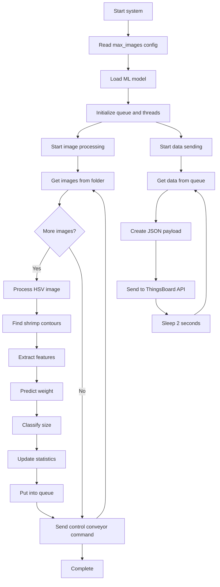
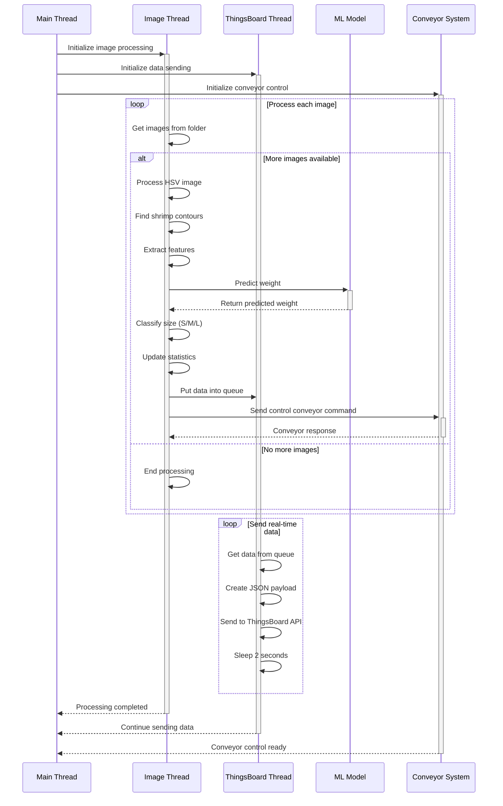
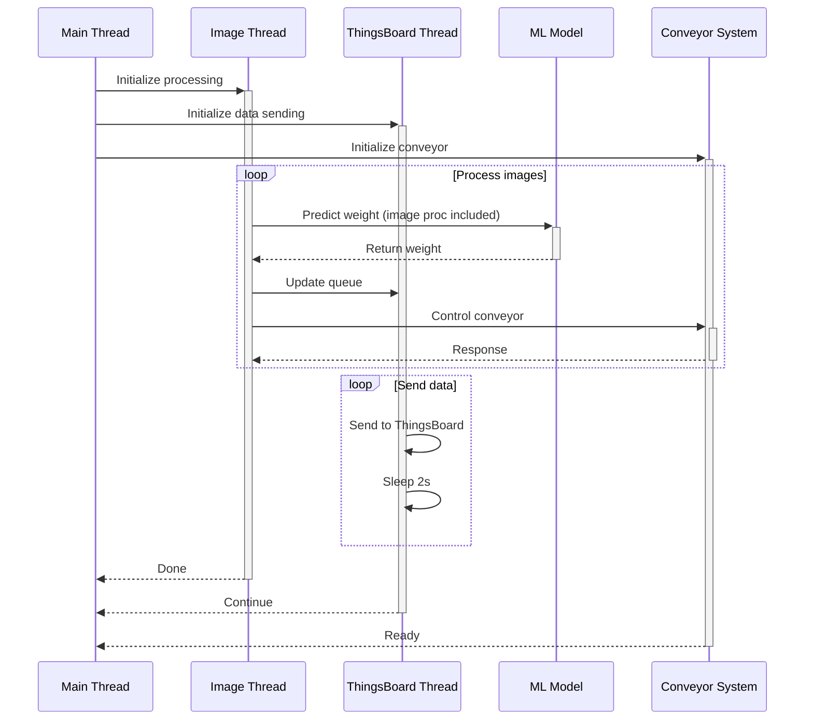

# SmartVision

```mermaid
flowchart TD
    A[Start system] --> B[Read max_images config]
    B --> C[Load ML model]
    C --> D[Initialize queue and threads]
    D --> E[Start image processing]
    D --> F[Start data sending]
    
    E --> G[Get images from folder]
    G --> H{More images?}
    H -->|Yes| I[Process HSV image]
    H -->|No| P[End processing]
    
    I --> J[Find shrimp contours]
    J --> K[Extract features]
    K --> L[Predict weight]
    L --> M[Classify size]
    M --> N[Update statistics]
    N --> O[Put into queue]
    O --> P[Send control conveyor command]
    P --> G
    
    F --> Q[Get data from queue]
    Q --> R[Create JSON payload]
    R --> S[Send to ThingsBoard API]
    S --> T[Sleep 2 seconds]
    T --> Q
    
    P --> U[Complete]
```

```mermaid
sequenceDiagram
    participant M as Main Thread
    participant IT as Image Thread
    participant TT as ThingsBoard Thread
    participant ML as ML Model
    participant CS as Conveyor System

    M->>+IT: Initialize image processing
    M->>+TT: Initialize data sending
    M->>+CS: Initialize conveyor control
    
    loop Process each image
        IT->>IT: Get images from folder
        alt More images available
            IT->>IT: Process HSV image
            IT->>IT: Find shrimp contours
            IT->>IT: Extract features
            IT->>+ML: Predict weight
            ML-->>-IT: Return predicted weight
            IT->>IT: Classify size (S/M/L)
            IT->>IT: Update statistics
            IT->>TT: Put data into queue
            IT->>+CS: Send control conveyor command
            CS-->>-IT: Conveyor response
        else No more images
            IT->>IT: End processing
        end
    end
    
    loop Send real-time data
        TT->>TT: Get data from queue
        TT->>TT: Create JSON payload
        TT->>TT: Send to ThingsBoard API
        TT->>TT: Sleep 2 seconds
    end
    
    IT-->>-M: Processing completed
    TT-->>-M: Continue sending data
    CS-->>-M: Conveyor control ready

```

#### Bản rút gọn

```mermaid
sequenceDiagram
    participant M as Main Thread
    participant IT as Image Thread
    participant TT as ThingsBoard Thread
    participant ML as ML Model
    participant CS as Conveyor System

    M->>+IT: Initialize processing
    M->>+TT: Initialize data sending
    M->>+CS: Initialize conveyor

    loop Process images
        IT->>+ML: Predict weight (image proc included)
        ML-->>-IT: Return weight
        IT->>TT: Update queue
        IT->>+CS: Control conveyor
        CS-->>-IT: Response
    end

    loop Send data
        TT->>TT: Send to ThingsBoard
        TT->>TT: Sleep 2s
    end

    IT-->>-M: Done
    TT-->>-M: Continue
    CS-->>-M: Ready

```